# Frontier Habitat 3.0

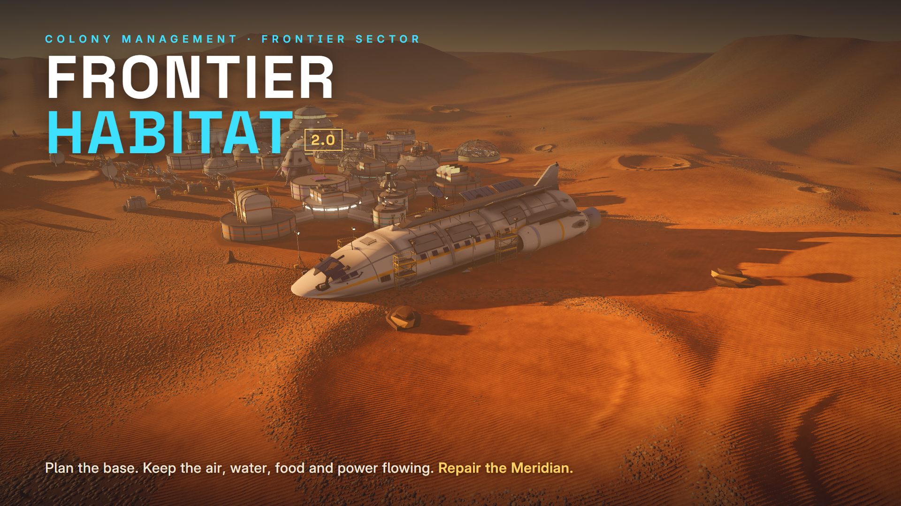

**Play in the browser:** https://paulbarby.github.io/frontier-habitat/

**Version 3.0** adds rigged and animated astronauts (a suit and an indoor variant, 24 clips,
smooth pose transitions) who sleep in beds, sit at tables and work at consoles; detailed
interiors for every room and size; real doorways where corridors meet rooms; modern interior
lighting; an 810 m map (10× the area); seven deterministic hazards (meteors, meteor showers,
wind and dust storms, quakes, solar flares, dust devils) plus wear-based breakdowns, hull
breaches and a meteor turret; research packs, a Research Assembler and a 45-tech tree. Every
visual subject passed a separate critic agent (0–1 rating, pass ≥ 0.65; `docs/critic/`).
Contract: `docs/V3_DESIGN.md`. Status: `docs/IMPLEMENTED.md`.

| | |
|---|---|
| 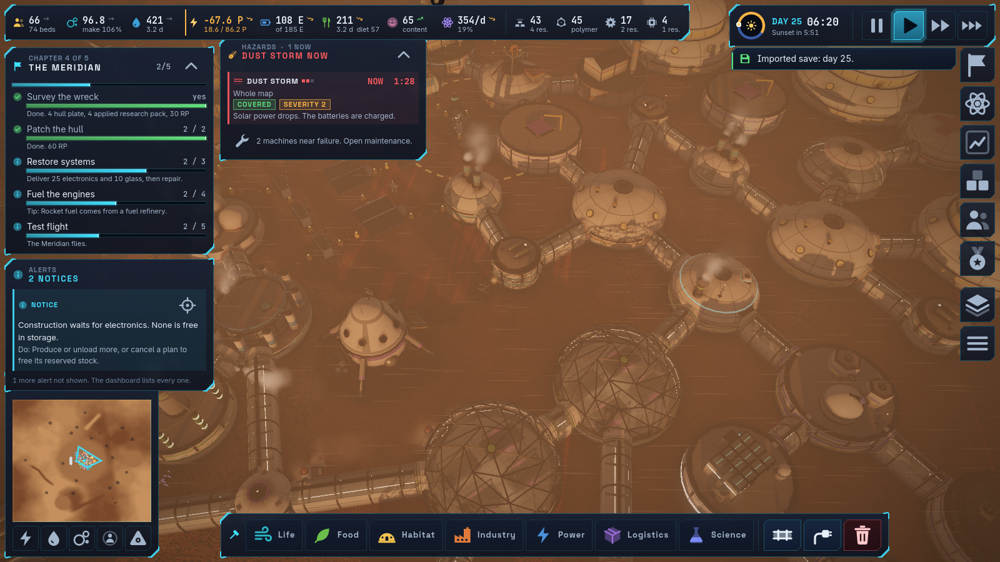 | 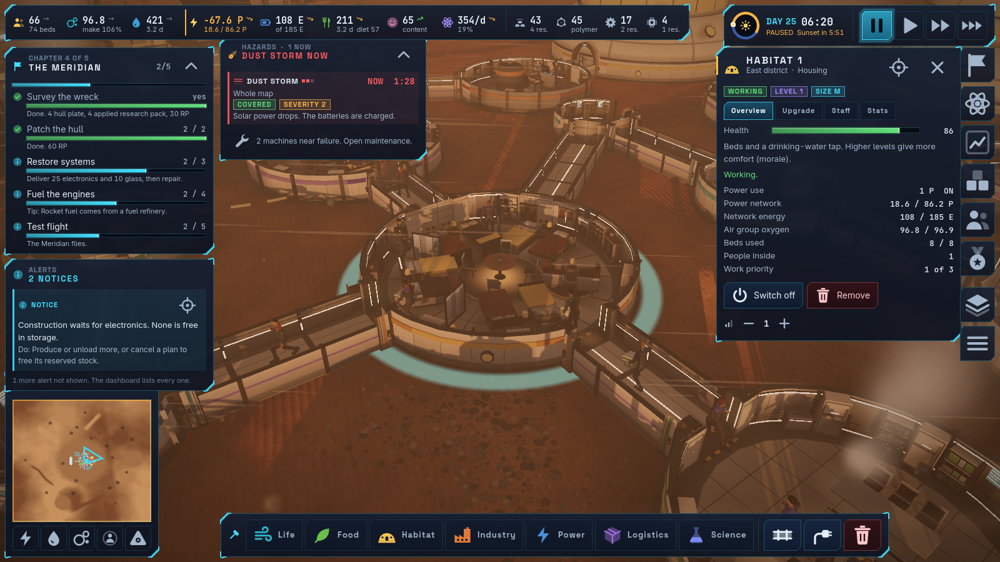 |
| 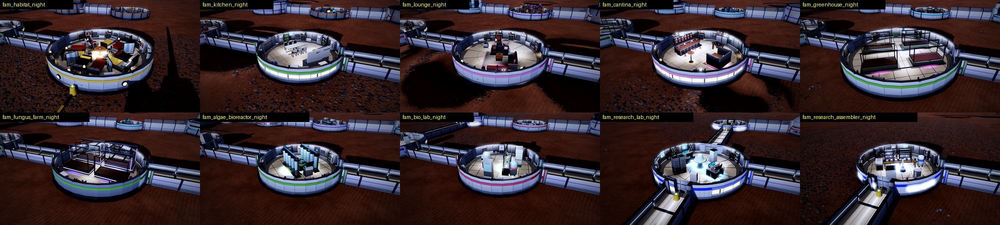 | 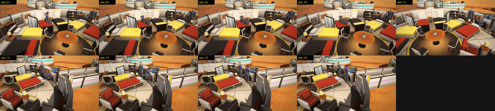 |
| 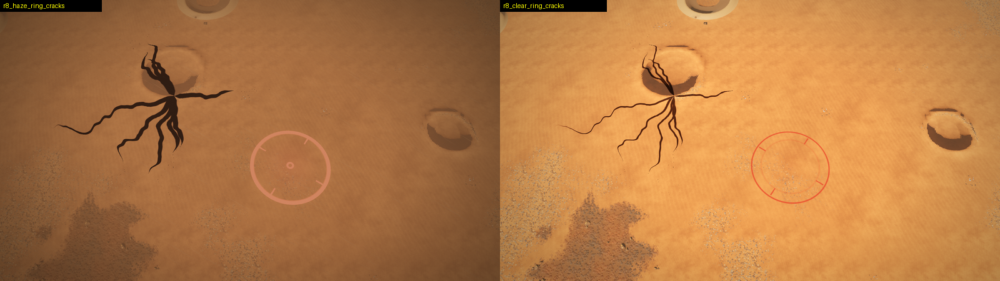 | 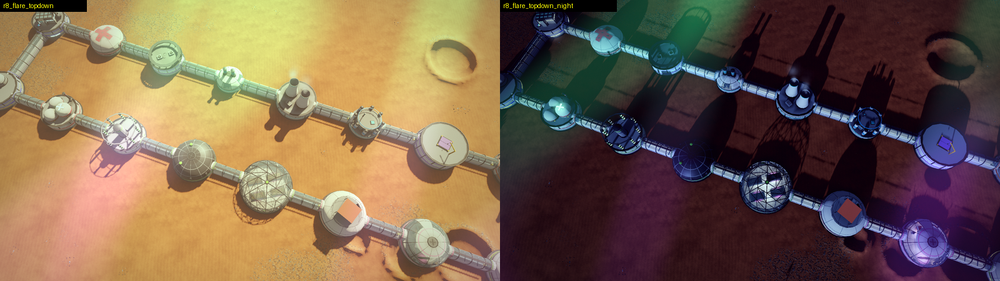 |

Astronaut sheets: `art/npc/`. Interior renders: `art/interiors/`. v3 showcase saves:
`showcase_v3_mid`, `showcase_v3_late` (810 m map, 66 colonists).

---


A single-player 3D colony management game on a dusty orange world. You plan the base; the
colonists do the work. Godot 4.4.1 (web export), models made in Blender 5.2.

**Version 2.0** adds: structures in 4 sizes (S, M, L, XL) and upgrade levels 1 to 5; a 29-tech
research tree whose tier-5 special research unlocks Level 5; 34 item types; 8 crops and 12
dishes with protein, carbs, fat and vitamins; spoilage and cold storage; a 5-chapter mission
(Touchdown, Sustain, Industry, The Meridian, Frontier) with supply-pod rewards; the crashed
colony ship Meridian to repair, test-fly and maintain; 32 awards; a charts dashboard; dust
storms; a new renderer (textured terrain, footpaths, sky, night lights, effects) and a new
interface. The contract is `docs/AAA_DESIGN.md`; status is `docs/IMPLEMENTED.md`;
screenshots are in `docs/shots/v2/` (v1 for comparison: `docs/shots/before_v1_day9.png`).

| | |
|---|---|
| 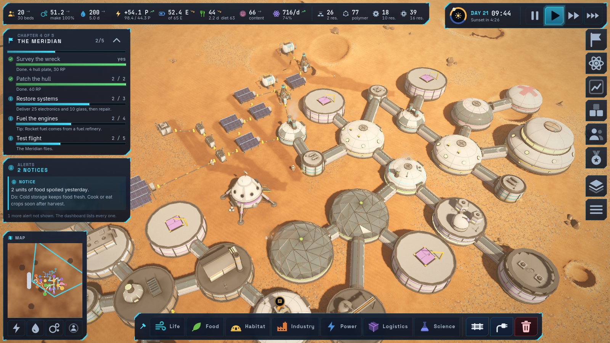 | 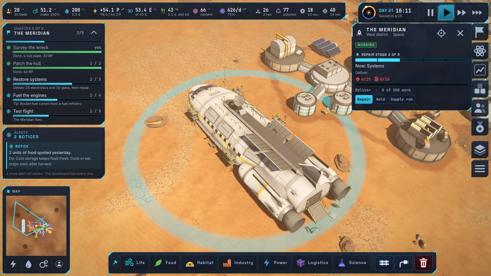 |
| 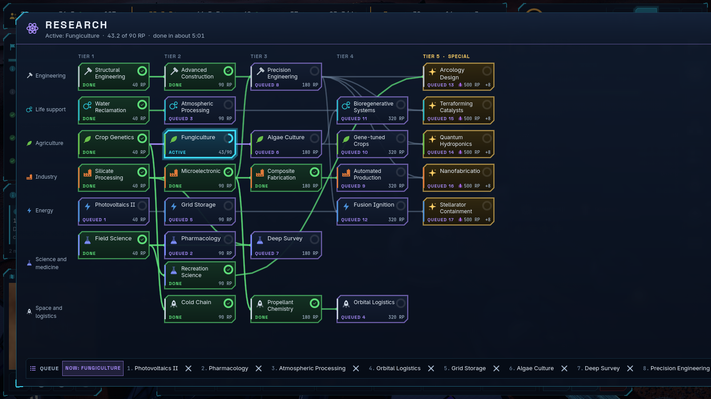 | 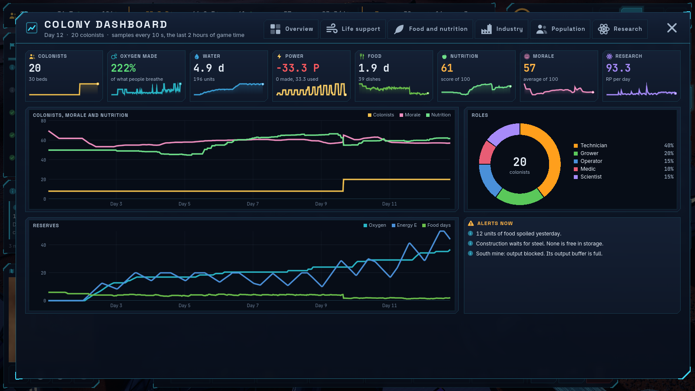 |
| 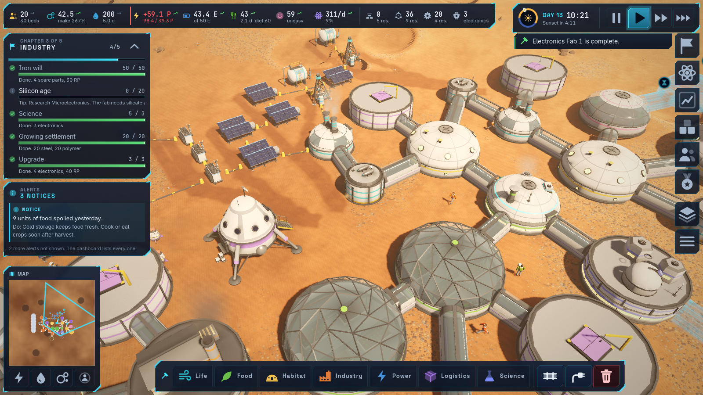 | 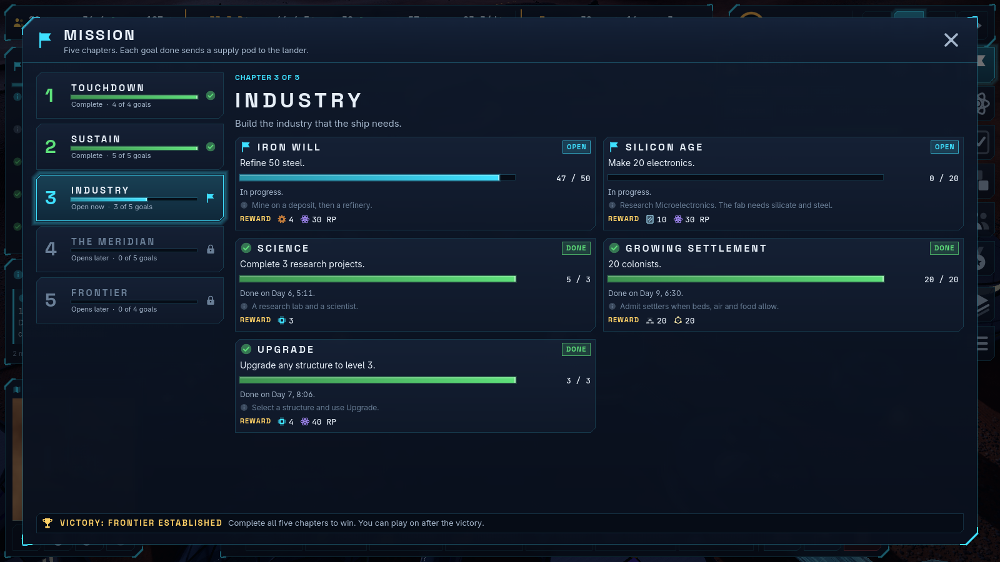 |

More art: `art/` (key art, screenshots, Blender model sheets in `art/models/`).

**Play locally on Windows:** double-click `Play Frontier Habitat.bat` (needs Node.js; it
starts a small local server and opens the game).

Showcase saves (Menu > Load, or `?load=res://content/saves/<file>`): `showcase_early`,
`showcase_mid`, `showcase_late` (Meridian under repair).

---


A single-player 3D planetary colony management game. You plan the settlement; autonomous
colonists do the work. Built from `planetbase-inspired-game-spec.md` (version 1.0).

Engine: Godot 4.4.1. Models: Blender 5.2. All code, models and text are original.

---

## Play it now

**Browser (the delivery target).** Start the static server and open the page:

```bash
node C:/Users/paulb/Claude/frontier-habitat/tools/serve.mjs 5791
```

Then open `http://localhost:5791/`. The build in `build/web/` is a plain static site:
`index.html`, `index.js`, `index.wasm`, `index.pck`. Any static host serves it. It does not
use threads, so it needs no cross-origin isolation headers.

**Desktop.**

```bash
"D:/Tools/Godot_v4.4.1-stable_win64.exe" --path C:/Users/paulb/Claude/frontier-habitat
```

**Load the delivered save** (a reference colony on day 9, 16 colonists, mining and refining):
Menu > Import save file > `saves/reference_day9.fhsave`.

**Watch it play itself:** Menu > "Demo: plan the reference outpost". The demo only submits
the same commands a player submits. The colonists build it under the normal rules.

---

## Controls

| Action | Key or mouse |
|---|---|
| Move the camera | W A S D or the arrow keys; optional screen-edge pan |
| Zoom | Mouse wheel |
| Turn | Hold the middle button, or Q and E |
| Select | Left click. Right click or Esc clears it |
| Place | Pick a structure in the bottom bar, R turns it 15°, left click places, Shift keeps the tool |
| Join | Corridor or Cable, then click the two structures |
| Follow a colonist | F |
| Overlays | O steps through power, water, air and walking |
| Time | Space pauses; 1, 2, 3 set 1x, 2x, 4x. You can plan while paused |
| Remove | Delete, or the Remove tool |

---

## The rules in one screen

- **Corridors carry people, power, water and air. Cables carry power and water only.**
  A room with no corridor has no air and nobody can walk into it.
- **Outside, a colonist has 90 seconds of suit air.** They refuse a job they could not walk
  back from, and they turn back at 30%. That limits useful building to about **85 m on foot
  from an airlock that has air**. The placement hint warns you before you place.
- **The lander air ends on day 3.** Before then you need an airlock, a habitat and an oxygen
  plant joined by corridors.
- **Food and materials must be carried.** A colonist carries two units. Power, water and
  oxygen flow through the networks instead.
- **Every stop has a reason.** The label over the structure and the alert panel name it, say
  how long you have, and say what to do.

---

## Build it yourself

```bash
# Models: writes assets/models/*.glb and preview PNGs
"C:/Program Files/Blender Foundation/Blender 5.2/blender.exe" --background --factory-startup --python tools/blender/rooms_build.py
# exteriors, ship, crops, colonists, props: see tools/blender/ext_report.md

# Tests: 60 headless tests, about eleven minutes (add "!long_" to skip the long runs)
node tools/godot.mjs test

# Web build
FH_ORCHESTRATOR=1 node tools/godot.mjs export build/web
```

The web export templates are installed in
`C:\Users\paulb\AppData\Roaming\Godot\export_templates\4.4.1.stable`. Only the two web
templates were downloaded (20 MB of the 1.2 GB archive) by `tools/fetch_web_templates.mjs`.

---

## Layout

| Folder | What is in it |
|---|---|
| `sim/` | The authoritative simulation. No scene, no node, no rendering. Runs headless. |
| `presentation/` | Camera, 3D view, model library, game root. Reads the simulation, never writes it. |
| `ui/` | Top bar, alerts, selection panel, build palette, colony report, menus. |
| `content/` | All tuning numbers and definitions as JSON. Edit these, not the code. |
| `assets/models/` | The .glb models made by Blender. |
| `tools/` | Blender build scripts, the web-template fetcher, the static server. |
| `tests/` | The headless test suite and the reference-save generator. |
| `docs/` | What is implemented and what is deferred. |

`sim/` and `presentation/`+`ui/` are separated exactly as the specification requires: the
interface submits commands and reads snapshots; it cannot change an inventory or a colonist.

## Editing the balance

Everything is in `content/`:

- `balance.json` — rates, needs, suit air, work, wear, morale, priorities, storage.
- `buildings.json` — cost, power, capacity and text of every structure.
- `recipes.json` — inputs, outputs, work and the role that does the work.
- `scenarios.json` — planets, the starting party and its cargo, tutorial seeds.
- `reference_layout.json` — the documented reference colony used by the tests and the demo.

No rate is hidden in the code. A change here changes the game and the tests measure it.

---

## Credits

Design, code, models and art made with Claude (Anthropic) for Paul Barby. Engine: Godot 4.4.1.
Fonts: Inter, Space Grotesk, JetBrains Mono (SIL Open Font License, see `assets/fonts/LICENSES.md`).
Sound effects generated with ElevenLabs.
